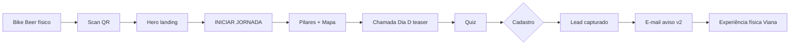

# Viana Experience

> Versão 1.1.0 · Status: draft · Gerado por ux-agent · **Implementar v1 primeiro**

## Objetivo

Construir a **vitrine digital oficial** que conecta turistas da Grande Vitória ao ecossistema turístico de Viana/ES — histórico, cervejeiro e de aventura — com foco no evento **Dia D do Turismo (junho/2026)**.

**Métrica de sucesso primária (v1):** cadastros qualificados (lead + voucher) originados de QR Code, tráfego orgânico e Bike Beer.

**Ação principal do usuário (v1):** escanear QR → entender o evento → **cadastrar-se** (voucher/quiz) → aguardar programação oficial.

**Modelo operacional (blindagem):** o site **não** processa pagamento nem gerencia overbooking. Na v2, exibe vagas e encaminha reservas ao operador via WhatsApp.

---

## Roadmap de versões

> **Decisão de produto (2026-05-22):** a programação oficial do Dia D **ainda não existe**. A v1 é **chamada ao evento**; detalhes operacionais entram na v2.

| Escopo | v1 — Chamada ao evento | v2 — Dia D operacional |
| --- | --- | --- |
| **Propósito** | Anunciar, gerar desejo, capturar leads | Informar, orientar logística, converter reservas |
| **Hero** | Countdown mês/período + CTA jornada | Countdown data/hora exata do evento |
| **Programação** | Teaser “Em breve” + eixos do dia (sem horários) | Timeline hora/local + banner ônibus |
| **Catálogo** | Preview por categorias (sem vagas/preços fictícios) | Catálogo completo + contadores + reserva WhatsApp |
| **FAQ** | Sobre o evento, cadastro, Viana | Pulseira, ônibus, cancelamento, logística |
| **CTA dominante** | **Cadastre-se / Quero ser avisado** | **Reservar vaga** + cadastro |
| **Nav “Programação”** | Âncora `#dia-d` (teaser) | Âncora `#programacao` (timeline) |

**Regra de ouro v1:** nunca publicar horários, rotas de ônibus ou vagas **inventados**. Copy honesta: “Programação oficial em breve — cadastre-se para receber primeiro.”

---

## Público-alvo

### Persona 1 — Turista metropolitano (primária)
- **Quem:** 25–45 anos, Grande Vitória (Vila Velha, Vitória, Serra), fim de semana.
- **Contexto:** descobriu via Bike Beer na orla ou indicação/redes; celular, sol forte, sessão curta (2–5 min).
- **Dor:** não conhece rotas/atrativos de Viana; medo de perder vaga escassa (ex.: 30 canoas).
- **Dispositivo prioritário:** mobile (375–430px).

### Persona 2 — Planejador antecipado (secundária)
- **Quem:** casal ou grupo, agenda com 2–4 semanas de antecedência.
- **Contexto:** desktop/tablet em casa; compara experiências e hospedagem.
- **Dispositivo prioritário:** desktop (1280px+).

### Persona 3 — Operador/empreendedor B2B
- **Quem:** pousada, cervejaria, operador de aventura que quer entrar no polo.
- **Ação:** formulário **Fale Conosco — Empresas** no Portal Institucional.

---

## Branding

### Posicionamento
**"O Motor Digital do Turismo"** — ponte oficial de conversão entre demanda metropolitana e oferta real de Viana, sem assumir risco logístico público.

### Tom de voz
- **Confiante e acolhedor**, não corporativo frio.
- **Regional com orgulho** (Capixaba, ES) sem exotização.
- **Urgência honesta** quando vagas são escassas — nunca fake scarcity.
- **Obi-Wan, não Luke:** Viana/Prefeitura orienta; o turista é o herói da jornada.

### Narrativa (5 segundos)
Turista prova a cerveja na orla → escaneia QR → ganha voucher no quiz → **se cadastra no Dia D** → (v2) recebe programação → viaja a Viana e vive a experiência.

### Assets existentes
| Asset | Caminho | Uso |
| --- | --- | --- |
| Logo horizontal | `inputs/VianaExperience1@4x.png` | Header, hero, footer, OG image |
| Logo @3x | `inputs/VianaExperience1@3x.png` | Mobile header |
| Setup físico | `inputs/WhatsApp Image 2026-05-19...` | Referência terracota/hops (accent secundário) |
| Guia estratégico | PDF Digital Engine (slides) | IA, jornada, reserva inteligente |

### Anti-referências
- Portal dashboard com tiles genéricos (wireframe manuscrito `polocervejeiro.com`) — **não usar como layout principal**.
- Checkout/e-commerce completo no site público.
- Estética SaaS roxa/azul gradiente, Inter-only, hero centrado vazio.
- Contador de confirmações fake agressivo (v1 incrementava aleatoriamente — substituir por dado real ou estático editorial).

---

## Direção visual

### Estilo predominante
**Editorial topográfico capixaba** — fundo creme com linhas de contorno sutis, tipografia serif verde escuro, acentos laranja (pin/CTA/alinhado ao sol do logo). Complemento terracota do material físico Bike Beer em badges e destaques esporádicos.

### Sensação
Descoberta de “joia escondida”; mapa aberto na mesa; festival regional premium, não carnaval genérico.

### Dials (ui-craft)
| Dial | Valor | Justificativa |
| --- | --- | --- |
| `VISUAL_VARIANCE` | 7 | Topografia + serif + logo custom; foge do template landing genérico |
| `MOTION_INTENSITY` | 5 | Reveals no scroll, parallax leve no mapa; sem animação decorativa excessiva |
| `INFORMATION_DENSITY` | 5 (v1) → 6 (v2) | v1 mais enxuta (teaser); v2 adiciona timeline + catálogo |

### Scene sentence
Turista em Vila Velha, celular na mão sob sol de tarde, acabou de escanear QR no ombrelone da Bike Beer — precisa entender em 10 segundos o que é Viana e por que cadastrar agora.

### Register
**Brand** na hero, pilares e chamada ao evento; **Product** na gamificação/cadastro (v1) e catálogo/reserva (v2).

---

## Paleta de cores

Extraída do logo PNG, slides Digital Engine e setup físico. Valores iniciais — validar contraste com `check-contrast` antes do ship.

| Token | Valor | Uso |
| --- | --- | --- |
| `--color-surface` | `#F6F0E4` | Fundo principal, topografia |
| `--color-surface-elevated` | `#FFFFFF` | Cards pilares, modais |
| `--color-surface-muted` | `#EDE4D0` | Faixas alternadas, map canvas |
| `--color-primary` | `#1F3A2E` | Texto display, header escuro, footer |
| `--color-primary-deep` | `#11231C` | Hero overlay, bordas fortes |
| `--color-accent` | `#E85D04` | CTA primário, pin mapa, números jornada |
| `--color-accent-hover` | `#C44D03` | Hover CTA |
| `--color-accent-sun` | `#F5A623` | Sol do logo, badges destaque |
| `--color-brand-green` | `#00A651` | Detalhes logo, ícones natureza |
| `--color-brand-green-muted` | `#3D5C40` | Subtítulo EXPERIENCE |
| `--color-terra` | `#B5421C` | Accent secundário (Bike Beer, tags aventura) |
| `--color-terra-deep` | `#7A2A11` | Sombras editoriais |
| `--color-ink` | `#1A1410` | Corpo de texto |
| `--color-paper` | `#F6EFDC` | Alternância seções |
| `--color-rio` | `#2E6E7A` | Rota das Águas no mapa |
| `--color-success` | `#1F3A2E` | Quiz correto, confirmação |
| `--color-error` | `#9B2C2C` | Quiz errado, erro form |
| `--color-on-primary` | `#F1E7D0` | Texto sobre verde escuro |
| `--color-on-accent` | `#FFFFFF` | Texto sobre laranja |

**Modo escuro:** não aplicável na v1. Header/hero usam verde profundo como “dark band” dentro da landing clara.

---

## Tipografia

| Token | Família | Desktop | Mobile | Peso | Uso |
| --- | --- | --- | --- | --- | --- |
| `--text-display` | DM Serif Display | 64–80px | 40–52px | 400 | H1 hero, títulos de seção |
| `--text-display-alt` | Alfa Slab One | 48–72px | 36–48px | 400 | Contagem regressiva, números poster |
| `--text-editorial` | DM Serif Display Italic | 18–22px | 16–18px | 400 italic | Subtítulos emocionais |
| `--text-body` | Bricolage Grotesque | 16px | 15px | 400–500 | Parágrafos, cards |
| `--text-label` | JetBrains Mono | 10–12px | 9–11px | 500–700 | Eyebrows, metadados, tabs |
| `--text-cta` | Bricolage Grotesque | 13px | 14px | 700 | Botões, uppercase tracking 0.08em |

**Line-height:** display 0.95–1.05; body 1.45–1.55.

**Letter-spacing:** labels uppercase 0.12–0.18em; display tight -0.02em.

**Escala fluida:** `clamp()` em H1/H2; body fixo 15/16px.

---

## Espaçamentos e grid

**Base unit:** 4px.

**Escala:** 4, 8, 12, 16, 24, 32, 48, 64, 80, 100.

**Max-width conteúdo:** 1440px (`--container-max`).

**Gutter:** 32px desktop · 20px tablet · 16px mobile.

| Breakpoint | Largura | Colunas | Comportamento |
| --- | --- | --- | --- |
| mobile | 0–639px | 4 | Stack total; nav drawer; map labels ocultos ≤480px |
| tablet | 640–1023px | 8 | Hero 1 col; grid experiências 2 col |
| desktop | 1024–1439px | 12 | Hero 2 col; experiências 3 col |
| ultra-wide | ≥1440px | 12 (max 1440) | Centrado; sem stretch de texto |

---

## Componentes

### Logo

- **Variantes:** horizontal PNG (preferido), compacto ícone-only ≤480px se necessário.
- **Estados:** default; sobre fundo escuro (header) — usar PNG com fundo transparente ou versão clara se existir.
- **Anatomia:** mark VIANA + sun dot + EXPERIENCE.
- **Tokens:** altura header 36px mobile / 44px desktop.
- **Comportamento:** link para `#top`; `alt="Viana Experience"`.
- **Responsividade:** `@3x` mobile, `@4x` desktop retina.

### Header (Nav)

- **Variantes:** sticky default; compact on scroll (opcional v1.1 — reduzir padding 14→10px).
- **Estados:** default, menu-open (mobile), link hover, link focus-visible, CTA hover.
- **Anatomia:** `[Logo] · [Contador Dia D] · [Contador cadastros?] · [Nav links] · [Hamburger]`.
- **Tokens:** bg `--color-primary-deep`, border-bottom 3px `--color-accent-sun`, text `--color-on-primary`.
- **Comportamento:**
  - Sticky `top: 0`, z-index 100.
  - Mobile: drawer 78% width, overlay `--color-ink` 55% opacity.
  - Links v1: Mapa · **Dia D** · O que vem · Gamificação · Institucional · **Cadastre-se** (CTA).
  - Links v2: adicionar Programação (timeline) e Experiências (catálogo operacional).
  - Teclado: trap focus no drawer; Esc fecha; `aria-expanded` no toggle.
- **Responsividade:** contadores full-width row abaixo do logo em ≤768px.

**Decisão v1.1:** contador “Pessoas Confirmadas” — usar número estático editorial (“+500 interessados”) ou integração real. **Não** simular incremento aleatório.

### Button

- **Variantes:** primary (laranja), secondary (outline ink), ghost (nav), destructive (raro).
- **Estados:** default, hover, focus-visible (ring 2px offset), active (translateY 1px), disabled (opacity 0.5), loading (spinner + aria-busy).
- **Anatomia:** label + optional icon →.
- **Tokens:** radius 4px; primary bg `--color-accent`; min-height 44px touch.
- **Copy primário hero:** `INICIAR JORNADA`.
- **Copy reserva:** `RESERVAR VAGA →`.
- **Copy cadastro:** `QUERO MEU VOUCHER →`.

### Counter (Contador)

- **Variantes:** countdown Dia D; vagas restantes (por card).
- **Estados:** pre-event, live (“AGORA!”), post-event.
- **Anatomia:** ícone + número + label mono.
- **Tokens:** dashed border amber/gold; número display serif.
- **Comportamento v1:** countdown para **junho/2026** (mês ou “Em breve” se data exata indefinida — ex.: `2026-06-01T00:00:00-03:00` ou copy “Jun/2026” sem dias).
- **Comportamento v2:** countdown com data/hora exata do Dia D.
- **A11y:** `aria-live="polite"` no countdown quando < 24h.

### Card — Pilar (3 colunas)

- **Variantes:** história (marrom), aventura (verde), cervejeiro (âmbar/marrom).
- **Estados:** hover lift (-2px), focus-within.
- **Anatomia:** ícone ilustração + H3 + subhead bold + body.
- **Tokens:** bg white, border decorativo geométrico 1px `--color-primary` 20%, radius 12px, shadow 0 4px 24px rgba(26,20,16,0.08).
- **Conteúdo fixo (slides):**
  1. História e Cultura — O Berço de Araçatiba
  2. Aventura Natural — A Rota das Águas
  3. Inovação Econômica — O Novo Polo Cervejeiro

### Card — Experiência (Catálogo) — **v2**

- **v1:** usar componente **Card Preview** (abaixo), não este.

### Card — Preview de experiência — **v1**

- **Variantes:** aventura, cerveja, hospedagem, gastronomia (4–6 cards, não 12+).
- **Estados:** default, hover.
- **Anatomia:** ícone/ilustração + categoria + título genérico + 1 linha descritiva.
- **Sem:** preço, badge de vagas, botão Reservar, tabs de filtro.
- **CTA único da seção:** “Quero ser avisado quando abrir” → `#gamificacao`.
- **Copy exemplo:** “Esportes de aventura · Canoagem, trilhas e mais” (não “Caiaque Duplo R$ 140”).

### Card — Experiência (Catálogo) — **v2**
- **Variantes:** cores `terra | jungle | amber | rio` por categoria.
- **Estados:** default, hover, sold-out, few-spots (<25%), med-spots (<60%).
- **Anatomia:** imagem 4:3 + tag + badge vagas + título + desc + preço + CTA.
- **Tokens:** border 2.5px `--color-ink`, shadow offset 6px.
- **Comportamento:**
  - Filtro tabs: Todas, Aventura, Polo Cervejeiro, Hospedagem, Gastronomia.
  - **Reservar Vaga** abre modal de captura mínima OU deep link WhatsApp direto (ver fluxo).
  - Badge vagas: “Apenas X vagas” / “Esgotado” / “XX vagas”.
- **A11y:** `article`; botão disabled quando esgotado com `aria-disabled`.

### Modal — Reserva / Cadastro

- **Variantes:** cadastro geral; reserva por experiência; sucesso.
- **Estados:** open, submitting, success, error.
- **Anatomia:** close + título experiência + form + actions.
- **Campos cadastro:** nome*, email*, telefone*, cidade (opcional), checkbox LGPD*.
- **Campos reserva:** herdados + experiência (hidden) + data preferida + nº pessoas.
- **Submit sucesso reserva:** mensagem + botão **Continuar no WhatsApp** (`wa.me/{operador}?text=...`).
- **ARIA:** `role="dialog"`, `aria-modal="true"`, focus trap, restore focus on close.

### Map Canvas

- **Variantes:** ilustrado SVG (não Google Maps v1).
- **Estados:** label hover; route banner static.
- **Anatomia:** SVG rotas + labels numerados + compass + legend cards.
- **Copy:** “Duas rotas. Uma cidade.” + legendas Rota das Águas / Polo Cervejeiro.
- **Interação v1:** labels clicáveis scroll to `#experiencias` filtrado (opcional v1.1).
- **Mobile ≤480px:** ocultar labels sobre mapa; legend cards abaixo são fonte de verdade.

### Teaser Dia D — **v1** (substitui Timeline)

- **Objetivo:** anunciar o evento sem cronograma fictício.
- **Anatomia:** eyebrow “DIA D DO TURISMO · JUN/2026” + H2 + parágrafo + **3–4 blocos temáticos** (ícone + label, sem hora).
- **Blocos temáticos sugeridos:**
  - Esportes de aventura (pêndulo, canoagem, trilhas)
  - Polo cervejeiro (cursos, degustações)
  - Hospedagem e gastronomia regional
  - Transporte integrado *(copy genérica: “logística pensada para você viver o dia inteiro” — sem horários de ônibus)*
- **Estado “Em breve”:** badge ou faixa `--color-accent-sun` com texto “Programação oficial em breve”.
- **CTA:** `QUERO SER AVISADO →` scroll `#gamificacao`.
- **Visual:** fundo `--color-jungle` ou `--color-primary`; cards claros; **não** usar linha do tempo horizontal/vertical com horários.

### Timeline (Programação Dia D) — **v2**
- **Variantes:** horizontal desktop; vertical mobile.
- **Estados:** stop default, stop major (destaque).
- **Anatomia:** linha tracejada + dots + time + name + loc + bus banner.
- **Conteúdo:** cronograma sábado Dia D (placeholder editável CMS/static).
- **Bus banner:** “Ônibus gratuito entre paradas · pulseira do evento”.

### Quiz (Gamificação)

- **Variantes:** pergunta única landing; rotação no Dia D (v1.1).
- **Estados:** unanswered, selected, correct, wrong, disabled pós-resposta.
- **Anatomia:** badge QUIZ + pergunta + 4 opções A–D + result strip.
- **Comportamento:** acerto → mensagem voucher; erro → educativo + CTA cadastro.
- **Pergunta v1:** “Qual rio passa pela Rota das Águas em Viana?” → Rio Jucu.

### FAQ Accordion

- **Estados:** collapsed, expanded.
- **Anatomia:** pergunta + ícone +/− + resposta.
- **A11y:** `button` header; `aria-expanded`; panel `role="region"`.

### Form — Fale Conosco

- **Variantes:** B2C (turista); B2B (empresa — campos extras: razão social, tipo negócio, polo desejado).
- **Estados:** idle, submitting, sent, error.
- **Feedback:** inline success; não usar apenas `alert()`.

---

## Estrutura de navegação

Landing **single page** com âncoras. Sem rotas secundárias na v1.

```
#top          Hero + INICIAR JORNADA
#pillars      A Joia Escondida (3 pilares)
#mapa         Mapa duas rotas
#dia-d        Chamada ao Dia D (teaser v1) → #programacao (timeline v2)
#o-que-vem    Preview categorias (v1) → #experiencias catálogo (v2)
#gamificacao  Quiz + cadastro voucher
#institucional Lei incentivo + realização
#faq          FAQ + contato B2C/B2B
```

**Header links (v1):** Mapa · Dia D · O que vem · Gamificação · Institucional · Cadastre-se (CTA → `#gamificacao`).

**Footer links:** repetir âncoras + WhatsApp institucional + Prefeitura (lei).

**QR Code deep links:** `/?ref=bikebeer` · `/?ref=evento` — hero scroll + highlight gamificação.

---

## Páginas

### Home — Landing editorial scroll (única página v1)

#### Objetivo da página (v1)
Converter visitante em **lead cadastrado** e comunicar que o **Dia D está chegando**, sem prometer detalhes ainda inexistentes.

#### Objetivo da página (v2)
Além do cadastro, encaminhar **intenção de reserva** ao operador privado via WhatsApp com programação e vagas reais.

#### Estrutura (ordem scroll)

| Ordem | Seção | ID | v1 | v2 |
| --- | --- | --- | --- | --- |
| 0 | Header sticky | — | ✓ | ✓ |
| 1 | Hero | `#top` | ✓ chamada + countdown período | + data exata |
| 2 | Pilares | `#pillars` | ✓ | ✓ |
| 3 | Mapa | `#mapa` | ✓ | ✓ |
| 4 | **Chamada Dia D** | `#dia-d` | ✓ teaser | substituído/ expandido |
| 4b | **Programação** | `#programacao` | — | ✓ timeline + ônibus |
| 5 | **Preview / Catálogo** | `#o-que-vem` / `#experiencias` | ✓ preview | ✓ catálogo + reserva |
| 6 | Gamificação | `#gamificacao` | ✓ **CTA principal** | ✓ |
| 7 | Institucional | `#institucional` | ✓ | ✓ |
| 8 | FAQ + Contato | `#faq` | ✓ copy v1 | + FAQ logística |
| 9 | Footer | — | ✓ | ✓ |

---

#### Seção 1 — Hero

**Conteúdo:**
- H1: logo PNG ou “Viana Experience” serif
- H2/sub: **O Motor Digital do Turismo**
- Body: “Conectando a Grande Vitória ao novo ecossistema histórico, cervejeiro e de aventura do Espírito Santo.”
- Pin laranja central (decorativo, não interativo)
- CTA fixo/fluido: **INICIAR JORNADA** → smooth scroll `#pillars`
- **v1 — poster countdown:** exibir “Jun/2026” ou meses/dias até início de junho; label **“Em breve: Dia D do Turismo”** (não “dias para o Dia D” com data falsa).
- Background: topografia SVG/CSS opacity 0.15 + grid sutil

**Hierarquia:** H1 > pin > H2 > body > CTA

**CTA secundário v1:** após pilares/mapa, repetir **QUERO SER AVISADO** → `#gamificacao`.

**Responsividade:**

| Elemento | Mobile | Desktop |
| --- | --- | --- |
| Layout | coluna centrada | texto esq + poster countdown dir (opcional) |
| Pin | 48px | 64px |
| CTA | full-width max 320px | auto, bottom-right hero como slide |

**Animações:**

| Elemento | Trigger | Tipo | Duração | Easing | Reduced motion |
| --- | --- | --- | --- | --- | --- |
| H1/H2 | load | fade-up 24px | 400ms | ease-out | opacity only |
| Pin | load | scale 0.9→1 | 500ms | spring stiff | none / static |
| Topografia | scroll | parallax Y 8% | — | linear | disabled |
| CTA | hover | brightness + translateY -1px | 150ms | ease | none |

---

#### Seção 2 — Pilares (“A Joia Escondida de Viana”)

**Conteúdo:** 3 cards (ver Componente Card Pilar).

**Faixa inferior (banner verde):**
“Viana possui o produto perfeito. O desafio agora é construir a vitrine digital.”

**CTA:** nenhum primário; scroll natural.

**Animações:** stagger reveal cards 80ms intervalo, fade-up 20px, 350ms.

---

#### Seção 3 — Mapa

**Objetivo:** traduzir “Duas rotas. Uma cidade.” em orientação visual.

**Conteúdo:** SVG ilustrado, banners Rota das Águas / Polo Cervejeiro, legend cards, compass.

**CTA secundário:** links nas legend cards → `#o-que-vem` (v1) ou `#experiencias` (v2).

**Responsividade:** aspect 16/9 desktop · 4/3 tablet · 3/2 mobile; labels hidden ≤480px.

---

#### Seção 4 — Chamada ao Dia D (`#dia-d`) — **v1**

**Objetivo:** criar expectativa pelo evento **sem publicar programação inexistente**.

**Conteúdo:**
- Eyebrow: `SEÇÃO 02 / DIA D · JUN/2026`
- H2: **Um dia inteiro de turismo em Viana**
- Sub: “Esportes de aventura, polo cervejeiro, hospedagem e muito mais — a programação oficial será divulgada em breve.”
- Grid 2×2 (mobile stack) de **blocos temáticos** — ícone + título + 1 frase (sem horário).
- Badge central: **Programação em breve**
- Faixa inferior: “Cadastre-se agora e seja avisado quando a agenda abrir.”

**CTA primário:** `QUERO SER AVISADO →` → `#gamificacao`

**Não incluir na v1:** timeline com horas, banner de ônibus com saídas, tabela de cronograma, copy “próxima saída 06:00”.

**Animações:** stagger nos blocos temáticos; badge pulse sutil 2s (respeitar reduced-motion).

---

#### Seção 4b — Programação Dia D (`#programacao`) — **v2**

**Objetivo:** publicar cronograma oficial hora/local/atividade + transporte **somente quando validado pela Secretaria de Turismo**.

**Conteúdo exemplo (substituir por dados reais na v2):**

| Hora | Atividade | Local | Major |
| --- | --- | --- | --- |
| 06:00 | Embarque | Praça Central | |
| 08:00 | Canoagem Rio Jucu | Margem norte | ✓ |
| … | … | … | … |

**Bus banner:** parceria transporte · saídas · pulseira — **dados reais obrigatórios**.

**CTA:** “Ver experiências disponíveis” → `#experiencias`.

**Migração v1→v2:** manter `#dia-d` como redirect/scroll para `#programacao` ou substituir seção in-place; atualizar nav “Dia D” → “Programação”.

---

#### Seção 5 — O que vem por aí (`#o-que-vem`) — **v1**

**Objetivo:** antecipar **tipos** de experiência sem inventar ofertas comerciais.

**Layout:** 4 cards preview (Aventura · Cervejeiro · Hospedagem · Gastronomia) — ver componente Card Preview.

**Copy seção:** “O Dia D reunirá o melhor de Viana. Enquanto finalizamos os parceiros, veja o que está por vir.”

**CTA único:** `QUERO SER AVISADO →` → `#gamificacao`

**Não incluir:** tabs, preços, vagas, modal reserva, `experiences.ts` com 12 itens seed.

---

#### Seção 5b — Catálogo de Experiências (`#experiencias`) — **v2**

**Objetivo:** vitrine + escassez real + handoff reserva.

**Filtros:** tabs horizontais scroll mobile.

**Cards:** mínimo 12 itens seed (aventura, cerveja, hospedagem, gastronomia) — dados em `src/data/experiences.ts`.

**Fluxo Reservar Vaga (Reserva Inteligente):**

```
Usuário clica RESERVAR VAGA
  → Modal: nome, telefone, email, nº pessoas
  → Submit
  → Tela sucesso + botão WhatsApp operador
  → wa.me pré-preenchido com experiência + dados
Operador: cobrança, logística, overbooking
```

**Campos operador por experiência (data layer):** `whatsapp: "5527999990000"`, `operatorName`.

**Estados card esgotado:** CTA “Lista de espera” → mesmo fluxo WhatsApp com copy diferente.

**Não implementar:** pagamento, carrinho, login.

---

#### Seção 6 — Gamificação e Cadastro — **CTA principal da v1**

**Objetivo:** retenção pós-QR + **captura de lead** (substitui conversão por reserva na v1).

**Layout:** 2 col desktop — esq banner cadastro, dir quiz card.

**Copy banner v1:**
- H2: “Seja o primeiro a saber”
- Sub: “Cadastre-se e receba a programação oficial, vouchers e novidades do Dia D.”
- Perks: Voucher R$50 *(quando confirmado)* · Aviso por e-mail · Brinde no evento · Prioridade no Dia D
- CTA: **QUERO SER AVISADO →** → modal cadastro

**Quiz:** integrado; acerto reforça benefício do cadastro.

**Pós-cadastro:** email de confirmação (v1.1 backend) ou mensagem inline v1.

---

#### Seção 7 — Portal Institucional

**Objetivo:** transparência pública + captação B2B.

**Blocos:**
1. **Lei de Incentivo ao Turismo** — Lei Municipal nº 4.218/24; link Prefeitura.
2. **Realização** — Polo de Turismo de Viana + Secretaria (Júlio).
3. **Fale Conosco — Empresa** — form estendido B2B.
4. **Projeto** — menção Francisco Cizino / Viana Experience.

**Visual:** faixa `--color-primary` texto claro; ícones lineares.

---

#### Seção 8 — FAQ + Contato B2C

**FAQ v1 (mínimo 5 itens):**
- O que é o Dia D do Turismo?
- Quando será o evento? *(jun/2026; data exata em breve)*
- Como me cadastro e o que recebo?
- Preciso pagar algo no site?
- Como minha empresa pode participar do polo?

**FAQ v2 (adicionar):** pulseira, ônibus, cancelamento, crianças, chuva — **somente com programação confirmada**.

**Form B2C:** nome, email, mensagem.

---

#### Footer

- Logo reduzido
- © 2026 Viana Experience · Dia D Jun/2026 · ES
- WhatsApp institucional `(27) 9 9999-0000` — link `wa.me` real
- Links âncora repetidos

---

## Fluxos de usuário

### Fluxo A — Jornada Bike Beer (v1)



### Fluxo A2 — Jornada completa (v2)

Adiciona: Programação → Catálogo → Reservar → WhatsApp → Dia D.

### Fluxo B — Reserva direta — **v2 only**

```
Entrada #experiencias → filtra categoria → lê vagas → RESERVAR VAGA
→ modal dados → WhatsApp operador → operador fecha venda
```

### Fluxo C — Empresa B2B

```
#institucional → Fale Conosco Empresa → submit → email secretaria (backend v1.1)
→ confirmação inline
```

### Fluxo D — Erro / edge

| Cenário | Comportamento |
| --- | --- |
| Esgotado | **v2 only** — CTA lista espera |
| WhatsApp indisponível | fallback `tel:` + copiar mensagem |
| Form inválido | inline errors; focus primeiro campo |
| Offline | banner “Sem conexão”; retry submit |

---

## Responsividade (global)

- **Mobile-first;** breakpoints 640 / 768 / 1024 / 1440.
- Tipografia fluida em títulos; body mínimo 15px.
- Imagens `next/image` com `sizes` responsivos; WebP/AVIF.
- Tabs catálogo: scroll horizontal touch; sem hover-only actions.
- Modais: 100% width − 24px mobile; max 540px desktop.
- Safe area iOS nos CTAs fixos bottom.

---

## Interações

| Elemento | Hover | Focus | Active | Disabled |
| --- | --- | --- | --- | --- |
| CTA primary | bg accent-hover | ring 2px accent offset 2px | translateY 1px | opacity 0.5 |
| Nav link | bg terra 20% | outline visible | — | — |
| Exp card | lift shadow | outline card | — | no hover if sold |
| Tab | bg muted | ring | bg ink active | — |
| FAQ | — | ring button | — | — |

**Focus ring global:** `outline: 2px solid var(--color-accent); outline-offset: 2px`.

**Cursor:** pointer em clicáveis; not-allowed esgotado.

---

## Microinterações

- Submit form: botão → spinner 300ms mínimo → success check morph.
- Tab filter: underline slide 200ms (transform, não width).
- Counter countdown: tick suave sem flash a cada segundo.
- Toast opcional v1.1: “Cadastro recebido” 4s auto-dismiss.
- Skeleton: cards catálogo enquanto imagens carregam (shimmer 1.5s).

---

## Motion design

**Princípios:** utilidade > decoração; respeitar `prefers-reduced-motion`.

| Token | Valor |
| --- | --- |
| `--motion-fast` | 150ms |
| `--motion-base` | 300ms |
| `--motion-slow` | 500ms |
| `--ease-out` | cubic-bezier(0.22, 1, 0.36, 1) |
| `--ease-spring` | stiffness 260, damping 24 |

**Scroll reveal:** IntersectionObserver ou Motion `whileInView` once, margin -10%.

**Parallax:** apenas hero topografia; desabilitar reduced-motion.

**Biblioteca sugerida:** CSS transitions v1; Motion (`motion/react`) para modal enter/exit se necessário.

---

## Regras de UX

1. **Uma ação primária por viewport** — v1: hero INICIAR JORNADA + gamificação QUERO SER AVISADO; v2: catálogo RESERVAR.
2. **Honestidade editorial (v1)** — zero horários, vagas ou preços não confirmados.
3. **Escassez real (v2)** — contadores de vagas só com dados validados.
4. **Progressive disclosure** — FAQ accordion; detalhes no modal quando existirem.
5. **Confiança pública** — lei de incentivo visível; na v2, operador privado na reserva explícito.
6. **QR context** — param `ref` ajusta copy hero (“Você veio da Bike Beer — garanta seu lugar na lista”).
7. **Sem dark patterns** — cadastro opcional para ver mapa, pilares e teaser do Dia D.

### Hierarquia de atenção

**v1:** Hero CTA → Countdown “Em breve” → Gamificação/Cadastro → Chamada Dia D → Pilares/Mapa.

**v2:** Hero → Countdown data exata → Catálogo com vagas → Programação → Cadastro.

---

## Regras de acessibilidade

| Critério | Requisito |
| --- | --- |
| Contraste texto | WCAG AA 4.5:1 body; 3:1 large text |
| CTA laranja/branco | Verificar ≥ 4.5:1; ajustar para `#C44D03` se falhar |
| Touch target | mínimo 44×44px |
| Focus visible | todos interativos |
| Teclado | ordem lógica; modal trap; Esc fecha |
| Imagens | alt descritivo; mapa decorativo `aria-hidden` + texto alternativo na legenda |
| Form | labels visíveis; errors `aria-describedby` |
| Motion | `@media (prefers-reduced-motion: reduce)` desliga parallax/reveals |
| Idioma | `<html lang="pt-BR">` |

---

## Assets necessários

| Asset | Formato | Dimensões | Observações |
| --- | --- | --- | --- |
| Logo | PNG/WebP | 800×200 approx | Export SVG futuro |
| Topografia pattern | SVG | tile 240×240 | Repeat background |
| Ícones pilares | SVG | 80×80 | Igreja, caiaque, barril |
| Fotos experiências | WebP | 800×600 | Substituir placeholders |
| OG social | PNG | 1200×630 | Logo + mapa + copy |
| Favicon | ICO/PNG | 32/180 | Sol verde logo |

---

## Guidelines para desenvolvimento

### Stack
- **Next.js 15+** App Router · **TypeScript** · **Tailwind CSS v4**
- Fonts: `next/font/google` — DM Serif Display, Bricolage Grotesque, JetBrains Mono
- Imagens: `next/image`; logo em `/public/logo/`
- Estado cliente: React context leve (cadastro count) — sem fake random increment

### Estrutura sugerida
```
src/
  app/page.tsx          # composição seções
  app/layout.tsx        # metadata, fonts, providers
  app/globals.css       # design tokens
  components/sections/  # Hero, Pillars, Map, DiaDTeaser, ...
  components/ui/        # Button, Modal, Counter, ...
  data/preview-themes.ts   # v1 — 4 categorias genéricas
  data/experiences.ts      # v2 — catálogo operacional
  data/faq.ts
  data/faq-v1.ts           # opcional: split FAQ por versão
  data/schedule.ts         # v2 only
  hooks/useCountdown.ts
```

### Feature flag sugerida
```ts
const SITE_PHASE: 'v1' | 'v2' = 'v1';
// ou env NEXT_PUBLIC_SITE_PHASE=v1
```
Permite ship v1 e ativar v2 sem redeploy de layout (só dados + seções condicionais).

### RSC boundaries
- Seções estáticas (Pilares, Map SVG, DiaD teaser): **Server Components**
- Quiz, Modal, Header menu, Countdown: **`use client`**

### Metadata (SEO) — v1
```ts
title: 'Viana Experience — O Motor Digital do Turismo · Viana/ES'
description: 'Dia D do Turismo em jun/2026. Duas rotas, uma cidade. Cadastre-se e seja avisado quando a programação oficial abrir.'
openGraph: locale pt_BR, images /og-viana.jpg
```

### O que NÃO fazer (v1)
- Publicar timeline, horários de ônibus ou vagas **sem dados oficiais**
- Checkout/pagamento in-site
- Dashboard tile home como página principal
- Contador fake auto-increment
- Catálogo com preços/reserva fictícios
- Ignorar logo PNG (não substituir por texto “VIANA.EXP”)

### O que NÃO fazer (v2)
- Reserva sem handoff WhatsApp explícito
- Hardcode vagas/preços desatualizados

### Integrações
| Integração | v1 | v2 |
| --- | --- | --- |
| E-mail transacional cadastro | desejável | ✓ |
| CMS programação/catálogo | — | ✓ |
| Analytics (`ref` UTM) | ✓ | ✓ |
| Admin vagas tempo real | — | ✓ |
| Notificar cadastrados “programação aberta” | — | ✓ |

---

## Checklist de implementação

### v1 — Chamada ao evento (ship inicial)

- [ ] Design tokens em `:root` conforme tabela
- [ ] Logo PNG no header/hero/footer
- [ ] Hero “O Motor Digital do Turismo” + INICIAR JORNADA
- [ ] Countdown **jun/2026** (período, sem data fictícia)
- [ ] Seção pilares 3 cards + banner
- [ ] Mapa SVG duas rotas + legend
- [ ] **Teaser Dia D** (`#dia-d`) — blocos temáticos + badge “Programação em breve”
- [ ] **Preview** `#o-que-vem` — 4 cards categoria, sem preço/vaga
- [ ] **Ausência** de timeline, ônibus e catálogo operacional
- [ ] Quiz + cadastro **QUERO SER AVISADO**
- [ ] Portal institucional + lei incentivo
- [ ] FAQ v1 (5 itens sobre evento/cadastro)
- [ ] Forms B2C/B2B
- [ ] Breakpoints 375 / 768 / 1280 testados
- [ ] Estados hover/focus/disabled/loading/error
- [ ] `prefers-reduced-motion`
- [ ] Contraste WCAG AA verificado
- [ ] Metadata SEO + OG (copy “cadastre-se / em breve”)
- [ ] LCP hero < 2.5s

### v2 — Dia D operacional (quando programação existir)

- [ ] Timeline `#programacao` com dados oficiais
- [ ] Banner ônibus/logística validado
- [ ] Catálogo `#experiencias` + tabs + badges vagas reais
- [ ] Fluxo reserva → modal → WhatsApp
- [ ] FAQ logística (pulseira, ônibus, etc.)
- [ ] E-mail “programação aberta” para cadastrados v1
- [ ] Countdown data/hora exata do evento
- [ ] Migrar nav e CTAs conforme roadmap

---

## Critérios de validação UX/UI

### v1

| Critério | Como verificar | Pass/Fail |
| --- | --- | --- |
| Formato Opção A scroll | Inspecionar single page âncoras | |
| Visual topográfico + logo | Compare tokens vs spec | |
| CTA INICIAR JORNADA | Click → #pillars smooth | |
| **Sem programação fictícia** | Ausência de horários/ônibus/vagas | |
| Teaser Dia D | Blocos temáticos + badge em breve | |
| Preview categorias | 4 cards sem preço/reserva | |
| CTA cadastro dominante | QUERO SER AVISADO visível ≥2× | |
| Gamificação | Quiz + cadastro modal | |
| Institucional | Lei 4.218/24 + form B2B | |
| FAQ v1 | Perguntas sobre evento, não logística | |
| Responsividade 375/768/1280 | Resize + device toolbar | |
| Focus teclado | Tab through modal/menu | |
| Contraste AA | axe ou check-contrast | |
| QR ref param | `?ref=bikebeer` copy | |

### v2 (adicional)

| Critério | Como verificar | Pass/Fail |
| --- | --- | --- |
| Programação oficial | Timeline alinhada a doc Secretaria | |
| Reserva inteligente | Reservar → WhatsApp operador | |
| Vagas reais | Badges batem com operadores | |
| Sem checkout | Ausência gateway pagamento | |
| Countdown data exata | Target ISO correto | |

---

## Pendências para aprovação do cliente

| ID | Item | Versão | Impacto |
| --- | --- | --- | --- |
| P1 | **Data exata Dia D** jun/2026 | v2 | Countdown preciso |
| P2 | **Programação oficial** (horários, paradas, ônibus) | v2 | Seção `#programacao` |
| P3 | **WhatsApp por operador** por experiência | v2 | Fluxo reserva |
| P4 | **Benefícios cadastro v1** (voucher R$50 confirmado?) | v1 | Copy gamificação |
| P5 | **Número cadastros** real vs omitir | v1 | Header counter |
| P6 | **Link oficial** Lei/Prefeitura | v1 | Portal institucional |
| P7 | **Fotos reais** atrativos | v1.1/v2 | Preview e catálogo |

---

## Changelog

| Versão | Data | Notas |
| --- | --- | --- |
| 1.1.0 | 2026-05-22 | Faseamento v1 (chamada) vs v2 (programação); teaser substitui timeline |
| 1.0.0 | 2026-05-22 | Spec inicial — Opção A aprovada; base Digital Engine PDF + inputs |
